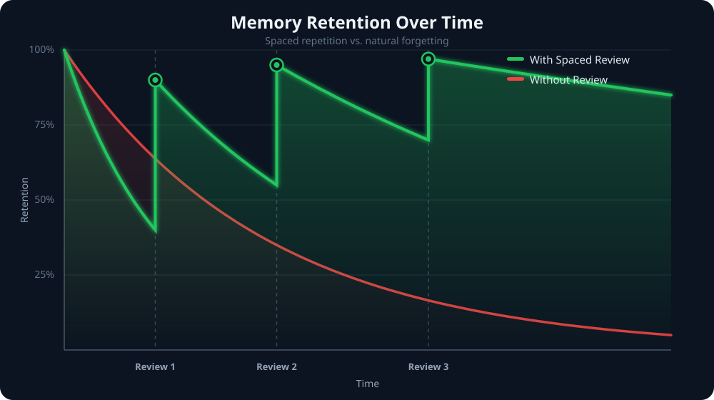

  
### *Engineering the future of mining education* 
 

 

## ⛏️ Who We Are

We're the technology team behind **[MinersBuddy](https://minersbuddy.vercel.app/)** — building an AI-powered learning platform that gives every mining student a smarter, more structured way to prepare for their DGMS certifications.

This account is where that platform gets built, piece by piece.

 

## 🌟 Our Vision

> *A mining student anywhere — from a small town to a big city — should have the same quality of exam preparation as anyone else.*

We believe good preparation shouldn't depend on scattered PDFs, outdated guides, or guesswork. MinersBuddy exists to turn that chaos into one clear, guided path — and this team is the engine that makes it real.

 

##  Under the Hood

How content connects, and how we time every revision so it actually sticks.

 

## 🚧 Currently In Progress

| Area | Status |
|---|---|
| 🌐 Core Web Platform | ✅ Live |
| 🧠 Smart Content & Test Engine | 🔨 Building |
| 📱 Mobile Experience | 🔨 Building |
| 📊 Personalized Analytics | 🔨 Building |
| 🔁 Continuous Improvements | 🟢 Ongoing |

We're early, we're building fast, and this profile evolves as the product does.

The core web platform where students access content, tests, and progress tracking. Actively maintained with new features shipped continuously.

 

## 📱 Mobile App

**Android & iOS App** — 🔨 In Development

## ✨ Features

<table align="center">
<tr>
<td valign="top">

**🔨 Ongoing**
- Metal Mines (MMR 1961) content
- Mock Tests & PYQs
- PDF Library (Handbooks, Guides, Formula Sheets)
- DGMS Announcements & circulars
- Personalized progress analytics
- Mobile app build

</td>
<td valign="top">

**🕐 Upcoming**
- Coal Mines (CMR 2017) content
- Downloadable exam syllabus (DGMS & JUT Diploma)
- Daily regulation tips
- Exam countdown tracker
- Dark mode
- Notification system

</td>
</tr>
</table>

 

## 🧠 What Makes It Smart

MinersBuddy isn't just static content — it adapts to *you*.

<table align="center">
<tr>
<td width="50%" valign="top">

**🎯 Personalized Prep**
The platform learns what you know and what you don't — and adjusts what it shows you accordingly.

**🧩 Content You Can Trust**
Every question and explanation is grounded in real regulations and past papers — no vague or made-up answers.

</td>
<td width="50%" valign="top">

**🔍 Search That Understands You**
Find what you need by meaning, not just exact keywords.

**⏰ Revise at the Right Time**
Smart reminders that surface topics right before you'd naturally forget them — not too early, not too late.

</td>
</tr>
</table>

**📈 A Profile That Grows With You**
The more you practice, the sharper your recommendations get — your weak areas get more attention, your strong areas stay fresh.

 

Clean commits, iterative shipping, and a product-first mindset — we'd rather ship something useful and improve it than wait for perfect.

 

  
## 📬 Connect
  

 

<i>Building, one commit at a time — for every miner's success.</i>

 
